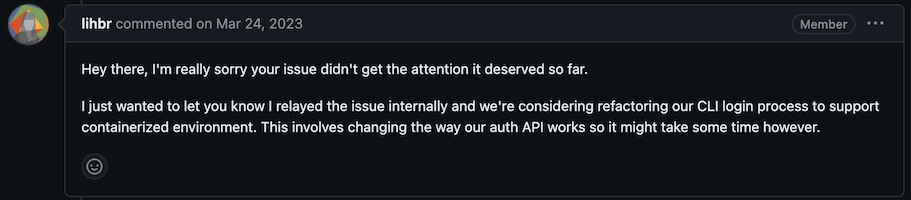

# Track

## Ability to run `slice-machine` within a sandbox

- [ ] ["Unable to run slice-machine within a VM sandbox"](https://github.com/prismicio/slice-machine/issues/1336)

- [ ] ["Unable to login"](https://github.com/prismicio/prismic-cli/issues/176) (Sep'22)

   - open

   

- [ ] ["`prismic-cli` fails to login inside a docker container"](https://github.com/prismicio/prismic-cli/issues/132) (Nov'21)

   - closed; likely not done, though?

